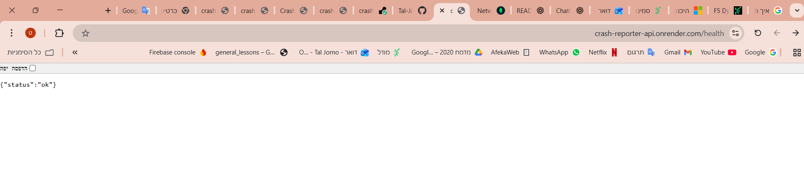
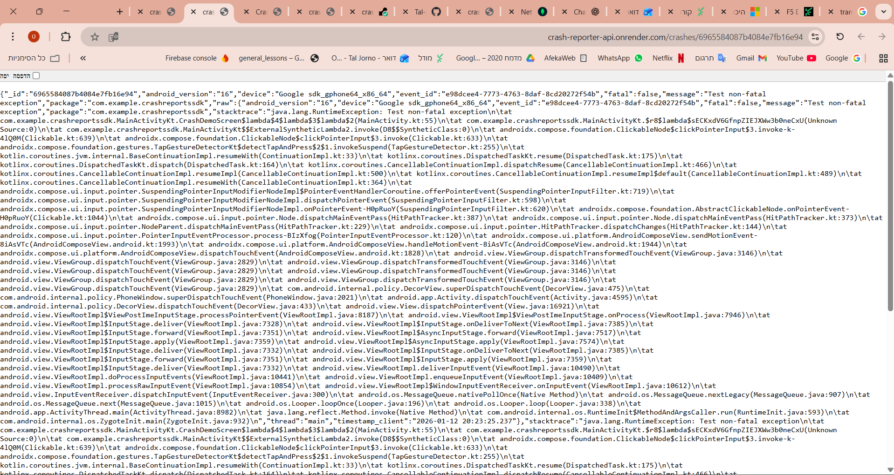

# Crash Reporter System (Full Stack)

This project is a complete crash reporting solution consisting of a **Flask/MongoDB Backend API** and an **Android SDK**. It allows you to track, store, and manage both fatal and non-fatal application crashes.

---

# Crash Reporter API (Backend)

A backend REST API for collecting Android crash reports and providing a minimal admin interface for management.

### 🛠 Tech Stack
* **Python 3.10+** (Flask)
* **MongoDB** (Local or Atlas)
* **REST API** architecture

### ✨ Features
* **Ingestion:** Receive fatal/non-fatal crashes from Android clients.
* **Storage:** Saves the full original JSON payload for debugging.
* **Admin UI:** Minimal web interface (`/admin`) to view and delete reports.
* **Health Check:** Dedicated `/health` endpoint for monitoring.

### 📡 API Endpoints
* `GET /health` - Check server status.
* `POST /crashes` - Send a crash report (JSON).
* `GET /crashes?limit=50` - Get latest crashes.
* `GET /crashes/<id>` - Get single crash details.
* `DELETE /crashes/<id>` - Remove a crash report.
* `GET /admin` - Access the minimal management portal.

### Data Integration
Data Model (JSON Payload)
The SDK sends and the API stores the following fields:
* message: The error message.
* stacktrace: Full stack trace string.
* fatal: Boolean (True if app crashed).
* package: App package name.
* device: Device model (e.g., Pixel 7).
* android_version: OS Version.
* timestamp: Entry time.

### Deployment
The API can be deployed to Render, Koyeb, AWS, or GCP.

### Screeshots




### ⚙️ Backend Setup & Running
1. **Installation:**
   ```bash
   pip install -r requirements.txt
